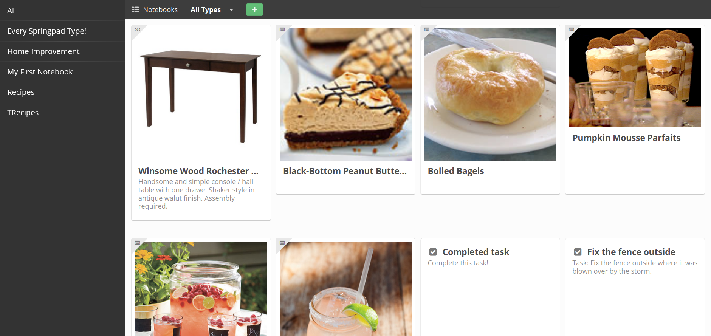

# Sprung

[Springpad.com](http://springpad.com/) (like too many other "cloud"
apps I've used) is shutting down. Thankfully, Springpad is making
[exports available](https://springpad.com/blog/2014/05/springpad-says-goodbye/)
to users as a simple HTML/JS/CSS viewer application and JSON data.

Sadly, that's nearly like being handed a print out. Our "modern"
filesystems give us little in the way of data *knowledge* and even
less in the way of curation, aggregation, annotation, and organization.

However! [Apache CouchDB](http://couchdb.apache.org/) is "built of the
Web" and is therefore quite concious of such needs.

## Meet Sprung!



## Installation

**Note:** I fully intend to make this all much easier. "Geeks" only atm.
Sorry. :frown:

1. Copy `config.json.sample` to `config.json`
2. Update the URL to match your settings.
3. Next install the necessary dev tools and dependencies via:
```
npm install
```
4. Build Sprung and the type definitions and publish them:
```
gulp
```

Once that's done, visit the URL based on your CouchDB URL, such as:
`http://localhost:5984/sprung/_design/sprung/index.html`

## oEmbed

Currently, Sprung uses oEmbed data for videos provided by
[oembedapi.com](http://oembedapi.com/). You should update the
`_docs/type~springpad-video/index.js` file to set the `origin` query paramater
properly or to use an alternate oEmbed retrieval API such as
[iframe.ly](http://iframe.ly/).

## Future

Springpad.com (may it rest in peace) was very close to a
note-taking-app-supreme idea that I've had for some time.

It's demise finally tipped the scales in favor of action. :smiley_cat:

## License

[Apache License 2.0](http://apache.org/licenses/LICENSE-2.0)
